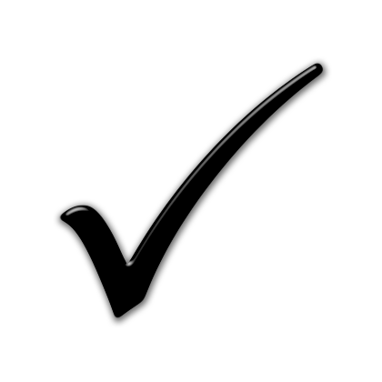

    

        

            

                About Us
                <h2 class="home-text2">
                  Advancing Knowledge and 
                  Innovation from Heart
                </h2>
                
                  Our organization operates as a distinguished research company based in Hong Kong, a pivotal center for innovation and scholarly collaboration.
                
                

                    

                        
                        Innovative Research Development
                    

                    

                        
                        Knowledge Dissemination
                    

                    

                        
                        Interdisciplinary Collaboration
                    

                    

                        
                        Research Excellence
                    

                    

                        
                        Impactful Solution
                    

                    

                        
                        Sustainability and Growth
                    

                

                
            

        

            
        

        

    

